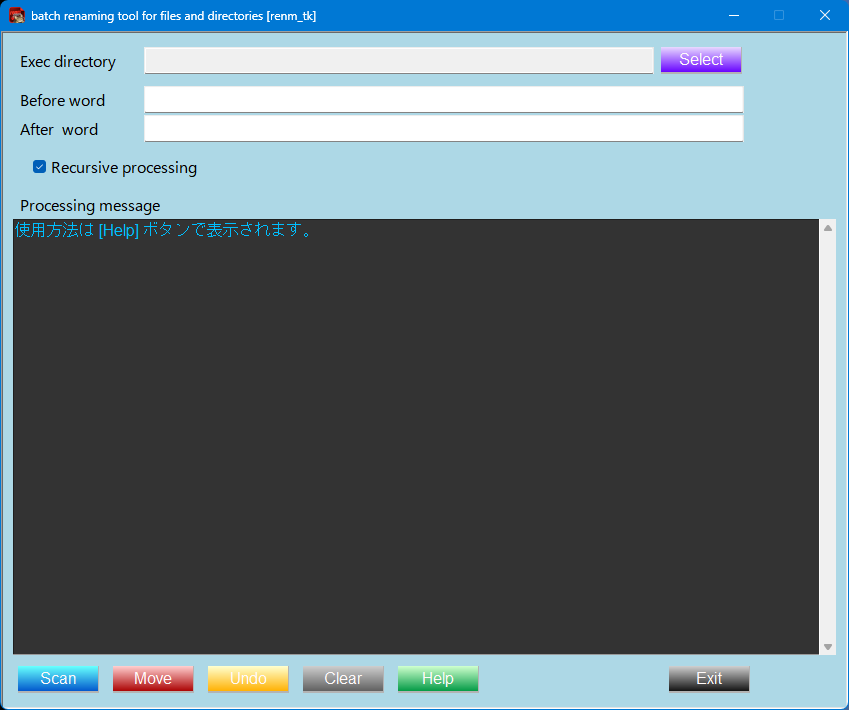
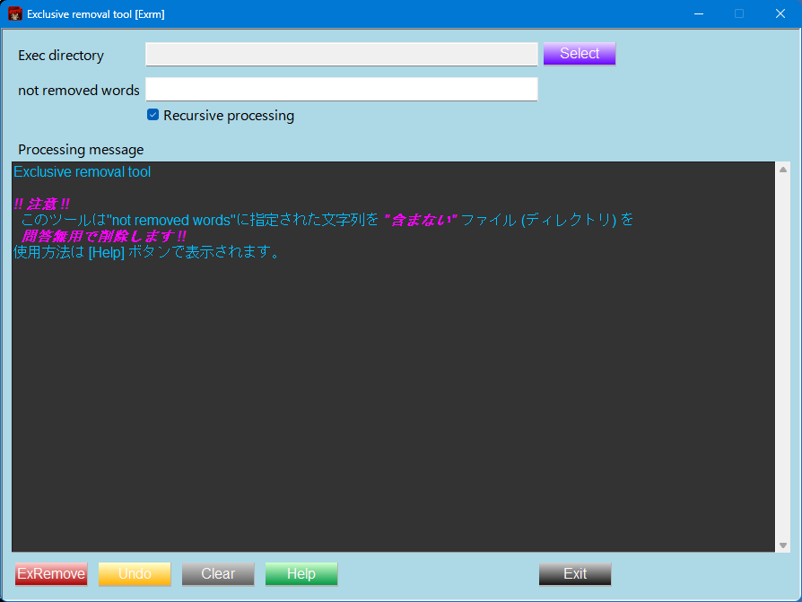
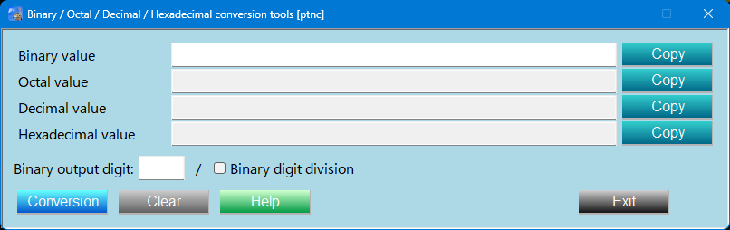
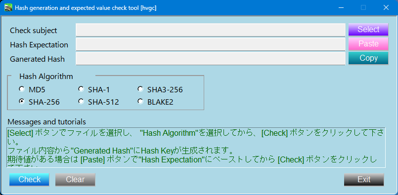
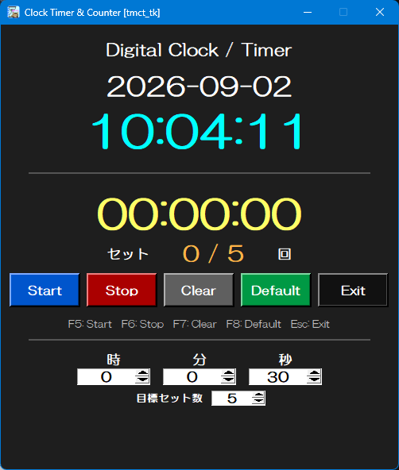

  
  

<!--

-->

# Overview
　環境追加不要の手軽さ及び動作の軽快性と単体起動(.exe)化した場合のサイズを重視して Python標準Libraryの **Tkinter** を使用したツール群。  
　設計思想を標準化しGUIを共通化しています。  
> [!NOTE]  
> 各画像をクリックして頂けると、拡大表示します。  

|Item|Content|  
|:--|:--|  
|OS| |  
|Language||  
|Library (GUI)|**Tkinter**|  
|Shell | 　**/**　
|Editor | 　**/**　 |  

# Tool Description
| Item | Description | Platform | Preview |   
|:--|:--|:--:|:--:|  
| [renm_tk](./renm_tk_readme.md) | ファイル一括リネームツール |  | |  
| [exrm_tk](./exrm_tk_readme.md)| 排他的ファイル/ディレクトリ削除ツール |  | |  
| [ptnc_tk](./renm_tk_readme.md) | 位取り記数法 (2,8,10,16進数) 変換ツール |  | |  
| [hvgc_tk](./renm_tk_readme.md) | Checksum (Hash値演算、比較) ツール |  | |  
| [tmct_tk](./tmct_tk_readme.md) | リハビリテーション支援 カウントダウンタイマー&カウンター|  | |  

> [!NOTE]  
> Itemのアプリケーション名は詳細ページ(GitHub)へリンクしています。  

# Why Tkinter
　本ツールはPython標準ライブラリのみの構成と動作の軽快性を重視し、Tkinter を採用しています。
- 動作の軽快感を重視  
- 標準ライブラリ使用による開発環境の構築容易化  
- 単体起動(.exe)化した場合のアプリケーションサイズの低減  
- パーツの共通化によるGUIの統一  
- 状態表示やメッセージ表示を組み込みやすい
- デスクトップユーティリティに適した構成

## Download the Release 
　[ Download Repository (GitHub)](https://github.com/AHazeyama/public/releases/latest)
