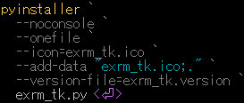

<p align="left">  
    
    
</p>  

<!--  
    
-->  

# exclusive removal tool [exrm_tk]  
[](./assets/prtsc/exrm_tk_win.png)  

## Overview  
　指定した文字列を **含まない** ファイル / ディレクトリを一括削除するためのデスクトップツールです。  
　大量のファイルやディレクトリを手作業で整理する際、削除対象の選別には時間がかかり、操作ミスも発生しやすくなります。  
　本ツールはそのような作業を効率化するために開発しました。  
  
## Purpose  
- 不要ファイル整理の手間の削減  
- 手作業による選別漏れや削除ミスの低減  
- 大量ファイルを対象とした反復作業を効率化  
- GUIによる条件付き削除の容易化  
  
## Features  
- 指定ディレクトリ配下のファイル / ディレクトリを一括処理  
- 指定文字列を **含まない** 対象を削除  
- 再帰処理対応  
- 処理内容を画面上に表示  
- Undoによる安全な復元  
- 各ツール間で共通部品使用によるUIの共通化  
- 単体exeで実行可能（Windows）  
- Windows / Linux でのCLI実行  
  
## Usage  
1. ｢**Select**｣ をクリックし、**Exec directory** を選択  
2. **not removed words** に**削除除外対象**に含まれる文字列を指定  
3. ｢**Scan**｣ をクリックし、**Prossesing nessage** に表示される削除対象を確認  
複数指定する場合は "**,**" で区切って下さい  
4. **☑ Recursive processing** で、下位階層に対する処理の可否を選択  
5. ｢**Delete**｣ をクリックして実行  
6. 必要に応じて ｢**Undo**｣ で元に戻す  
  
> [!WARNING]  
>　本ツールはファイル / ディレクトリ構成を変更します。  
>　誤操作により意図しない結果になる可能性があります。  
>　そのため、以下の対策を実装しています  
>- 処理内容の可視化（ログ表示）  
>- バックアップ生成（.bk）  
>- Undoによる復元機能  
>※ 実運用では、重要データに対して使用する前にテスト用ディレクトリでの確認を推奨します。  

## Use Case  
- 作業フォルダ内の不要ファイル整理  
- 一部のキーワードを含む成果物だけを残したい場合  
- ビルド生成物や中間ファイルの整理  
- 大量の検証ファイルから必要なものだけを残す作業  
  
## UI Components  
### Input items  
| Item | Description |  
|:--|:--|  
| Exec directory | 処理対象ディレクトリ |  
| not removed words | 削除対象外とする文字列 |  
| ☑ Recursive processing | 下位ディレクトリを含めて再帰処理 |  
| Processing message | 処理内容・注意事項の表示 |  
### Buttons  
| Button | Description |  
|:--|:--|  
| ExRemove | 削除実行 |  
| Clear | 入力内容の初期化 |  
| Undo | 直前状態への復元支援 |  
| Help | 操作方法表示 |  
| Exit | アプリ終了 |  
  
## Tech Stack  
- Python 3.x  
- Tkinter  
  
## Design / Implementation Points  
- 単なる削除ツールではなく、**条件付き一括削除** に特化  
- GUI から扱えるようにして、CLI に不慣れな利用者でも操作可能  
- 危険な処理であるため、画面上に注意メッセージを明示  
- Undo を実装し、操作リスクの軽減を意識  
- 処理メッセージ表示により、何が起きているかを分かりやすく可視化  
  
## Build (for developers)   
### 　Python 開発環境共通設定  
　　Pythonを使用した開発に関する共通設定を記載しています。  
　　[ **Common settings for the development environment**](https://github.com/AHazeyama/Tkinter_tools/blob/main/CommonSettings.md)

### 　exrm_tk **(.exe)** 作成コマンド  
<details>  
<summary>
　
　  

　　　　[](./assets/env/M_FILE_version.png)
</summary>  
  
```pwsh
pyinstaller `  
  --noconsole `  
  --onefile `  
  --icon=exrm_tk.ico `  
  --add-data "exrm_tk.ico;." `  
  --version-file=exrm_tk.version `  
  exrm_tk.py  
```  
</details>  

　　**.exe** 出力  :　. / dist /  

## Download the Release 
　[ Download Repository (GitHub)](https://github.com/AHazeyama/public/releases/latest)
  
## License  
　TBD  