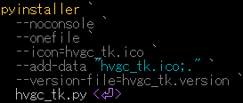

<p align="left">  
      
      
</p>  

<!--  
  
-->  
  
# hash value generation & comparison tool [Tkinter]  
<p align="left">  
    
</p>  
  
## Overview  
　ファイルの整合性確認（**Checksum検証**）を手作業で行う際の手間とミスを削減するために開発したツールです。  
　複数のハッシュアルゴリズムに対応し、生成結果と期待値の比較をワンステップで実行可能です。  
　業務における検証作業の効率化およびヒューマンエラー防止を目的としています。

## Purpose  
- checksum検証の容易化  
- 製品出荷時の補償作業(SUM値算出)容易化  
  
## Features  
- ファイルからハッシュ値を生成
- 期待値との比較（**Match** / **Discrepancy** 表示）
- ｢**Select**｣による選択、または Drag & Dropによるチェック対象の転送（Upload）
- 複数アルゴリズム対応  
　**MD5** / **SHA-1** / **SHA3-256** / **SHA-256** / **SHA-512** / **BLAKE2**
- クリップボードから期待値を貼り付け（Paste）
- シンプルなUIによる直感的操作
- エラーハンドリング（未選択・不正入力）
- メッセージ表示による操作ガイド

## Usage  
1. 「**Select**」で対象ファイルを選択  
2. ハッシュアルゴリズムを選択  
3. 期待値を貼り付け（任意）  
4. 「**Check**」をクリック  

## Use Case  
- ダウンロードファイルの整合性確認
- 配布物の改ざん検知（内容保証）
- 検証作業の自動化前段階としての利用

## UI Components  
### Display content
>| Item | Description | I/O |
>|:--|:--|:--:|  
>|Check subject |Hash生成対象ファイル|In|  
>|Hash Expectation |Hash期待値|In|  
>|Generated Hash |生成Hash Key|Out|  
>| Hash Algorithm|Hash生成アルゴリズム<br>　MD5  SHA-1 / SHA3-256 / SHA-256 / SHA-512 / BLAKE2 から選択|  
>|Messages and tutorials |処理メッセージ及び操作方法|Out|  
### Buttons  
>| Button | Description |  
>|:--|:--|  
>|Select|Hash生成対象ファイル選択|  
>|Paste|期待値ペースト(クリップボード内容をペースト)|  
>|Copy|生成Hash Keyをコピー|  
>|Check|Hash生成及び期待値比較|  
>|Clear|入力情報消去|  
>|Exit|ツール終了|  

## Tech Stack  
- Python 3.x  
- Tkinter  
  
## Design / Implementation Points  
- ローカル環境での検証ツール
- 社内向けAPIとしての利用
- GUI から扱えるようにして、CLI に不慣れな利用者でも操作可能  

## Build (for developers)   
### 　Python 開発環境共通設定  
　　Pythonを使用した開発に関する共通設定を記載しています。  
　　[ **Common settings for the development environment**](https://github.com/AHazeyama/Tkinter_tools/blob/main/CommonSettings.md)

### 　hvgc_tk **(.exe)** 作成コマンド  
<details>  
<summary>
　
　  

　　　　[](./assets/env/M_FILE_version.png)
</summary>  
  
```pwsh  
pyinstaller `  
  --noconsole `  
  --onefile `  
  --icon=hvgc_tk.ico `  
  --add-data "hvgc_tk.ico;." `  
  --version-file=hvgc_tk.version `  
  hvgc_tk.py  
```  
</details>  

　　**.exe** 出力  :　. / dist /  

## Download the Release 
　[ Download Repository (GitHub)](https://github.com/AHazeyama/public/releases/latest)
  
## License  
　TBD  