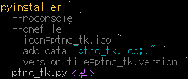

  <p align="left">
    
    
</p>
<!--
      
-->

# positional numeral conversion tool [Tkinter]
<p align="left">
  
</p>

## Overview
　位取り記数法 (**2,8,10,16進数**) 変換を行うツールです。

　2進数10桁(Excel上限)を超える数値を扱う事が出来ます。  
　単位区切り(SI接頭語)","を挿入する事が出来ます。

## Purpose
- 位取り記数法への変換  
- 2進数変換時の表示桁数、桁区切り文字","の挿入  

## Features
- 位取り記数法 (**2,8,10,16進数**) 変換
- 負数(2進数では2の補数表現)に対応
- 桁区切り"**,**"を挿入可能
- 2進数の出力桁数を指定可能(先頭"0"詰め)
- シンプルなUIによる直感的操作
- エラーハンドリング（未選択・不正入力）
- メッセージ表示による操作ガイド

## Usage
1. "**Binary**"**,**"**Octal**"**,**"**Decimal**"**,**"**Hex**"のいずれかの**"**value**"**欄に数値を入力
2. ｢**Conversion**｣をクリック
3. 各"value"に表示された数値の｢Copy｣をクリック

## Use Case
- 数値を各位取り記法の数値へ変換  
(2進数はExcel上限以上の桁に対応)
- 桁区切り","の付加  
(Windows｢電卓｣では桁区切りがスペース)

## UI Components  
### Display contents
>| Item | Description |
>|:--|:--|
>|Binary value|2進数値入力 or 2進数変換値表示|  
>|Octal value|8進数値入力 or 8進数変換値表示|  
>|Decimal value|10進数値入力 or 10進数変換値表示|  
>|Hexadecimal value|16進数値入力 or 16進数変換値表示|  
>|Binary output digit|2進数表示桁数|  
>|☑ Binary digit division|2進数桁区切り(4bit)|  

### Buttons
>| Button | Description |  
>|:--|:--|  
>|Copy|左欄の数値をコピー|  
>|Conversion|数値変換|  
>|Clear|入力値、変換値削除|  
>|Help|操作方法表示|  
>|Exit|終了|

## Tech Stack  
- Python 3.x
- Tkinter

## Design / Implementation Points  
- 単なる削除ツールではなく、**条件付き一括削除** に特化  
- GUI から扱えるようにして、CLI に不慣れな利用者でも操作可能  
- 危険な処理であるため、画面上に注意メッセージを明示  
- Undo を実装し、操作リスクの軽減を意識  
- 処理メッセージ表示により、何が起きているかを分かりやすく可視化  

## Build (for developers) 
<details>  
<summary>
　
　  

　　　　[](./assets/env/M_FILE_version.png)
</summary>  
```pwsh
pyinstaller `  
  --noconsole `  
  --onefile `  
  --icon=ptnc_tk.ico `  
  --add-data "ptnc_tk.ico;." `  
  --version-file=ptnc_tk.version `  
  ptnc_tk.py  
```  

</details>  

　　**.exe** 出力  :　. / dist /  

## Download the Release 
　[ Download Repository (GitHub)](https://github.com/AHazeyama/public/releases/latest)
  
## License  
　TBD  
